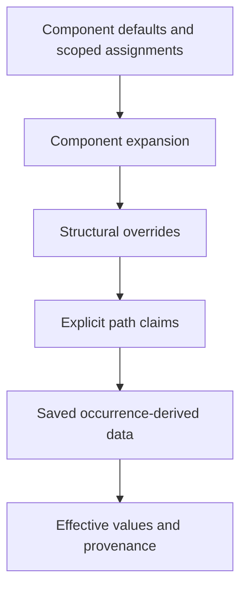

# Instance evaluation



This is an overview of evaluation stages, not a universal last-write-wins rule. Nested
owners, binding scopes, placed-root geometry, and replacement data impose additional rules.

## Addressing

A property path is relative to its declaring owner. Ordinary containers may be traversed
without adding an instance boundary; nested instances require an explicit segment.

```text
Owner
  +-- instance A -> Label (source L)
  +-- instance B -> Label (source L)

[A, L] != [B, L]                 valid distinct addresses
[L] across an instance boundary  not an implicit recursive search
```

Component GUIDs and component override keys can address the root. A binding-driven replacement
can retain the source component's root identity without retaining its old descendant targets.
A placed instance's explicit size remains separate from unscaled root-override size.

## Provenance

| Origin | Interpretation |
| --- | --- |
| Component default | Inherited unless superseded. |
| Property assignment | Supplies a binding value; not equivalent to its default. |
| Explicit path override | Declared by an owner against a complete path. |
| Saved derived data | Effective geometry/typography; not automatically a user override. |
| Editor mutation | Recorded through the shared editing domains after materialization. |

```text
default Label = "Badge"
  +-- untouched instance -> inherits later component changes
  +-- explicit "Badge"  -> remains overridden despite equal text
```

Definitions with `parentPropDefId` inherit semantics within source ancestry while retaining
local property identity. Current typed `varValue` and `PROP_REF` parameter records are
normalized alongside older property forms.

**Implemented:** occurrence-local re-expansion preserves unrelated explicit claims. Newer
bindings retire claims on the fields they supersede. Swaps retire claims against removed
subtrees. A known removed target is not remapped onto a similarly named replacement child.

## Worked precedence example

```text
Contribution                text            opacity
--------------------------  --------------  -------
Component default           "Badge"         1.0
Intermediate explicit claim "Custom"        0.4
Outer text assignment       "Assigned"      --

Effective result            "Assigned"      0.4
Retained intermediate claim --              0.4
```

This illustrates the tested binding re-expansion case: the outer assignment supersedes the
intermediate text claim without erasing unrelated opacity. It is not a universal ordering of
all possible Figma fields.

```text
BEFORE SWAP                         AFTER SWAP
Component A                         Component B
  A/Label [explicit text claim]        B/Icon
  A/Icon                              B/Caption

A/Label does NOT become B/Caption merely because both contain text.
```

## Names

Stored `name` alone is not proof of an explicit rename. Figma save captures distinguish
root-targeted name claims. Untouched replacement instances use the component name, or the
component-set name for variants. Initial stored names are not globally rewritten.

**Known limitation:** complex compositions of inherited renames, bindings, and structural
swaps still have unresolved oracle cases. Direct `swapComponent()` behavior must not be assumed
to describe every saved-record composition.

## Derived text

Changing text or shaping properties invalidates inherited glyph caches unless a patch supplies
replacement data. Later occurrence-derived glyph data can replace that invalidated cache.
Paint-only changes do not alter glyph positions. Re-expansion must apply the same validity rule.
See [materialization](./materialization.md) for rendering and editing boundaries.

## Diagnostics

Strict mode rejects missing or ambiguous targets. Explicit diagnostic callbacks can permit
partial property or assignment evaluation; missing structural swap targets remain fatal.
Reports retain owner, effective component context, complete path, and assignment payload where
applicable. Partial evaluation is research support, not successful production acceptance.

## Implementation and tests

- [Interpreter](../src/instance-overrides/interpret.ts)
- [Binding evaluation](../src/instance-overrides/interpret-bindings.ts)
- [Text provenance](../src/instance-overrides/text-provenance.ts)
- [Addressing tests](../tests/instance/addressing.test.ts)
- [Binding precedence tests](../tests/instance/bindings.test.ts)
- [Root-key tests](../tests/instance/root-key.test.ts)
- [Swap provenance tests](../tests/instance/swap-provenance.test.ts)
- [Name capture provenance](../tests/instance/fixtures/README.md)

**Known limitation:** field coverage and provenance transitions are not complete. The current
recipe/patch-restoration implementation must not be mistaken for a finalized evaluation model.
